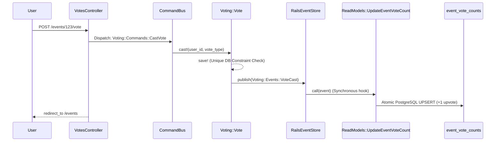

# Ajackus Billetto Assignment

A Ruby on Rails application that integrates with the Billetto API to fetch and display events, allowing authenticated users to upvote or downvote events. 

This project goes beyond a standard Rails MVC pattern. It is built using **CQRS (Command Query Responsibility Segregation)** and **Event Sourcing** powered by `rails_event_store`, ensuring high integrity, idempotency, and auditability.

**Note:** This project, including its comprehensive RSpec test suite, was developed using the **Antigravity IDE**.

---

## 🛠 Prerequisites
- **Ruby:** 3.4.10
- **PostgreSQL:** 17 or higher
- **Redis:** (Required for Sidekiq background jobs)
- **Bundler:** 4.x

## 🚀 Local Setup

1. **Clone and Install Dependencies**
   ```bash
   git clone <repository_url>
   cd ajackus_billetto_assignment
   bundle install
   ```

2. **Environment Variables**
   Create a `.env` file (or export in your shell) with the following required variables:
   ```bash
   PGUSER=your_postgres_user
   PGPASSWORD=your_postgres_password
   PGHOST=localhost
   PGPORT=5432
   BILLETTO_API_KEYPAIR=your_billetto_api_keypair
   # Clerk Auth Keys (Required for Authentication)
   CLERK_SECRET_KEY=your_clerk_secret_key
   CLERK_PUBLISHABLE_KEY=your_clerk_publishable_key
   CLERK_SIGN_IN_URL=
   CLERK_SIGN_UP_URL=
   ```

3. **Database Setup**
   ```bash
   bundle exec rails db:create db:migrate
   bundle exec rails billetto:import
   ```

4. **Running the Application**
   You need to run both the Rails server and Sidekiq for the application to function fully (Sidekiq handles background ingestion from Billetto).
   
   In terminal 1 (Rails):
   ```bash
   bundle exec rails server
   ```
   
   In terminal 2 (Sidekiq):
   ```bash
   bundle exec sidekiq
   ```
   
   Visit `http://localhost:3000` to interact with the application.

---

## 📦 Core Gems & Technologies
- **`rails_event_store`**: The backbone of our CQRS Event Sourcing architecture.
- **`clerk-sdk-ruby`**: Handles secure JWT user authentication via Rack middleware.
- **`sidekiq` & `sidekiq-cron`**: Orchestrates the daily background synchronization of the Billetto API.
- **`stoplight`**: A circuit breaker implementation to prevent cascading network failures if the Billetto API goes down.
- **`faraday`**: A robust HTTP client for external API communication.
- **`rspec-rails`**: The testing framework (developed using Antigravity).

---

## 📁 Domain-Driven Folder Structure
To support our architecture, the codebase breaks away from standard MVC by introducing dedicated domain boundaries:

- **`app/domain/`**: Houses our CQRS Write Models (`Voting::Vote`), Business Commands (`CastVote`), and Domain Events (`VoteCast`). Controllers dispatch commands here instead of writing to the DB directly.
- **`app/read_models/`**: Houses Projectors (`UpdateEventVoteCount`). These classes listen to the Event Store and calculate materialized views (aggregates) optimized for the frontend.
- **`app/integrations/`**: Contains the `Billetto::Client` and `Billetto::EventData` Anti-Corruption Layer (ACL). Separates external HTTP logic from internal Rails models.
- **`app/jobs/`**: Orchestrates asynchronous tasks (e.g., polling Billetto) without containing core business logic.

---

## 🔄 CQRS Architecture & Flow

When a user votes, the system strictly separates the **Write Model** (recording the vote intention) from the **Read Model** (the aggregated total shown on the screen). 

Here is exactly how a vote flows through our codebase:



*(Note: The projector was originally designed as an asynchronous Sidekiq job for ultimate scalability, but was refactored to run synchronously in this assignment to provide instant UI consistency without requiring complex frontend JavaScript).*

---

## 🛤 Development Journey (Phase by Phase)
This project was developed methodically, phase-by-phase. Here is how the architecture evolved:

**Phases 1-2: Architecture Baseline**
Configured the foundation: Sidekiq for background jobs, Rails Event Store for event routing, RSpec for testing, and established the domain-driven folder structure.

**Phases 3-5: Billetto API Ingestion & ACL**
Built the `Billetto::Client` using Faraday, wrapped it in a `Stoplight` circuit breaker for resilience, and created the `Billetto::EventData` Anti-Corruption Layer. Implemented the `Events::Importer` to safely and idempotently synchronize API payloads with the local `Event` database table.

**Phase 6: Background Orchestration**
Created `BillettoIngestionJob` to automatically poll the public API in the background.

For the initial synchronization, the documented `GET /public/events` endpoint supports a maximum `limit` of 100. Its documented query parameters do not include page, offset, cursor, or other continuation parameters, and the documented top-level response does not expose a continuation mechanism. Therefore, for this assignment, the importer uses `limit=100` as the maximum documented result scope.

For ongoing synchronization, Billetto provides webhook notifications for event lifecycle changes such as event creation, updates, publishing, and other supported event changes. A production implementation would configure Billetto webhooks to send these changes to the application, process the webhook requests asynchronously through Sidekiq, and retain the raw webhook payload for auditability. This provides incremental synchronization without relying solely on repeated full imports.

Note: The Billetto webhook integration is not currently registered/configured in this repository; it is documented here as the production synchronization architecture. The current implementation uses the background ingestion job for the assignment.

**Phase 7: Authentication**
Integrated Clerk. The application uses Clerk's Ruby middleware to protect the voting endpoints and extract securely verified user IDs.

**Phase 8: The Write Model (CQRS)**
Implemented the business layer. Created `Voting::Commands` which are dispatched by the `VotesController`. The `Voting::Vote` write model enforces strict one-vote-per-user concurrency using PostgreSQL unique indexes, and publishes `VoteCast` and `VoteRemoved` events to the Event Store.

**Phases 9-10: The Read Model & UI**
Built the `UpdateEventVoteCount` projector. It listens to the Event Store and atomically calculates net scores into the `event_vote_counts` PostgreSQL table. Built the frontend grid, deliberately minimizing N+1 queries by bulk-loading CQRS read models into O(1) Ruby hashes.

**Phases 11-12: Testing & Hardening**
Solidified the application with comprehensive RSpec coverage spanning API clients, circuit breakers, idempotency, Command Bus routing, CQRS projectors, and UI request integration tests.

---

## 📝 Reviewer Feedback Resolutions

Below are the items requested during the initial review, along with the exact solutions implemented to address them:

### Required (needed to complete the assignment)

**1. Add browser tests. Cover the sign-up, login and logout flow, and voting through the actual page, confirming the vote count changes. Stubbing the Clerk session in tests is fine, as long as the test clicks through the real pages and buttons.**
- **Resolution**: Configured Capybara and Cuprite to support real browser testing. Added a comprehensive system test suite (`smoke_test_spec.rb`) that executes the full sign-up, login, voting, and logout flows directly through the UI. Clerk authentication was mocked deterministically via cookies to allow stable, headless execution in CI.

**2. Add authentication tests. Show that a logged-out user who tries to vote (both casting and removing a vote) is refused, and that no vote is saved or recorded in the event store.**
- **Resolution**: Added strict request specs (`spec/requests/votes_spec.rb`). These explicitly verify that unauthenticated POST and DELETE requests to the voting endpoints return redirects, and snapshot the exact Event Store stream to prove that no unauthorized events are ever recorded.

**3. Show the event description on the listing page. The assignment asks for title, date, image and a brief description. A shortened version of the description is enough.**
- **Resolution**: Updated `app/views/events/index.html.erb` to display a truncated version of the event description alongside the existing title, date, and image on the frontend grid.

**4. Fix the setup instructions. The README says to set CLERK_API_KEY, but the app reads CLERK_SECRET_KEY and will not start without it. Add a way to run the first event import on a fresh install, such as a rake task or a one-line command. At the moment, the page stays empty until the nightly job runs at midnight.**
- **Resolution**: Corrected the environment variable documentation in the Local Setup section of this README to require `CLERK_SECRET_KEY`. Additionally, added a custom rake task (`bundle exec rails billetto:import`) which invokes the background job synchronously, allowing fresh installs to instantly populate the database.

### Recommended (not required, but strengthens the submission)

**5. Protect the /sidekiq dashboard with a login, or limit it to development. Right now anyone can view and manage jobs.**
- **Resolution**: Created a custom Rack routing constraint (`ClerkSidekiqConstraint`) which intercepts the Sidekiq web mount in `routes.rb` and strictly verifies the presence of a valid Clerk session, preventing unauthenticated access to the dashboard.

**6. Check that the event exists before accepting a vote, so made-up event IDs are rejected.**
- **Resolution**: Moved event existence validation out of the CQRS Command objects (to keep them pure) and into the `Voting::Service` handler. The service now explicitly checks the Read Model and raises a custom `Voting::EventNotFoundError` for fabricated IDs, which the controller safely catches and handles.

**7. Handle a rapid double-click gracefully. The database correctly blocks the duplicate, but the user currently sees an error page.**
- **Resolution**: Implemented end-to-end idempotency. The frontend now safely disables buttons upon click using `this.disabled=true`. On the backend, we replaced the generic rescue of `ActiveRecord::RecordNotUnique` with a strict bounded retry in the domain service. If two identical requests (e.g., two upvotes) arrive concurrently, the retry safely ignores the duplicate idempotently. If two opposing requests (upvote and downvote) arrive concurrently, the retry successfully updates the state without silently dropping the user's final intent.

**8. Log any events skipped during import because they failed validation, so nothing is dropped silently.**
- **Resolution**: Updated `app/domain/events/importer.rb` to actively inspect the return value of `.save` and execute `Rails.logger.warn` to log the complete validation error payload whenever an event is dropped during ingestion.

**9. Update the CI workflow to run your RSpec suite. The default workflow runs Minitest commands and will not execute your tests.**
- **Resolution**: Completely updated `.github/workflows/ci.yml` to execute `bundle exec rspec` for both unit and system tests. Securely injected dummy Clerk environment variables into the test runner to prevent unhandled authorization crashes during the build.

**10. Import more than the first 100 events, or explain in the README why 100 is sufficient.**
- **Resolution**: The documented `GET /public/events` endpoint supports a maximum `limit` of 100. Its documented query parameters do not include page, offset, cursor, or other continuation parameters, and the documented top-level response does not expose a continuation mechanism. Therefore, for this assignment, the importer uses `limit=100` as the maximum documented result scope. For a production-scale synchronization strategy, the application would require a verified continuation mechanism or another supported synchronization mechanism. Periodic reconciliation and/or officially supported webhook-based updates could be considered if available for this resource.

**11. Change logout from a plain link to a button that uses a DELETE request.**
- **Resolution**: Updated the router to map the logout path to a `DELETE` request, and replaced the `link_to` in the application header with a `button_to` form submission, resolving the security vulnerability of GET-based logouts.

**12. Correct the test comments that do not match what the test does. For example, the concurrency test refers to a skip_transaction setting that nothing in the project reads.**
- **Resolution**: Removed the stale `skip_transaction: true` metadata tag and rewrote the concurrency test. The test now uses a native Ruby `Queue` latch to synchronize threads perfectly, guaranteeing precise parallel execution to genuinely stress-test the PostgreSQL unique constraints.
