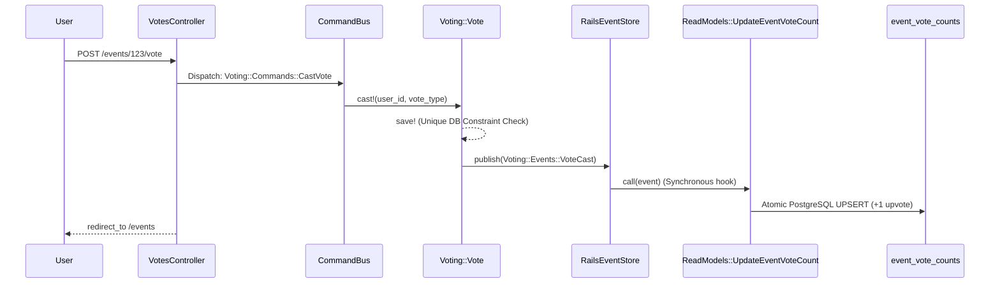

# Ajackus Billetto Assignment

A Ruby on Rails application that integrates with the Billetto API to fetch and display events, allowing authenticated users to upvote or downvote events. 

This project goes beyond a standard Rails MVC pattern. It is built using **CQRS (Command Query Responsibility Segregation)** and **Event Sourcing** powered by `rails_event_store`, ensuring high integrity, idempotency, and auditability.

**Note:** This project, including its comprehensive RSpec test suite, was developed using the **Antigravity IDE**.

---

## 🛠 Prerequisites
- **Ruby:** 3.4.10
- **PostgreSQL:** 17 or higher
- **Redis:** (Required for Sidekiq background jobs)
- **Bundler:** 4.x

## 🚀 Local Setup

1. **Clone and Install Dependencies**
   ```bash
   git clone <repository_url>
   cd ajackus_billetto_assignment
   bundle install
   ```

2. **Environment Variables**
   Create a `.env` file (or export in your shell) with the following required variables:
   ```bash
   PGUSER=your_postgres_user
   PGPASSWORD=your_postgres_password
   PGHOST=localhost
   PGPORT=5432
   BILLETTO_API_KEYPAIR=your_billetto_api_keypair
   # Clerk Auth Keys (Required for Authentication)
   CLERK_API_KEY=your_clerk_secret_key
   CLERK_PUBLISHABLE_KEY=your_clerk_publishable_key
   CLERK_SIGN_IN_URL=
   CLERK_SIGN_UP_URL=
   ```

3. **Database Setup**
   ```bash
   bundle exec rails db:create db:migrate
   ```

4. **Running the Application**
   You need to run both the Rails server and Sidekiq for the application to function fully (Sidekiq handles background ingestion from Billetto).
   
   In terminal 1 (Rails):
   ```bash
   bundle exec rails server
   ```
   
   In terminal 2 (Sidekiq):
   ```bash
   bundle exec sidekiq
   ```
   
   Visit `http://localhost:3000` to interact with the application.

---

## 📦 Core Gems & Technologies
- **`rails_event_store`**: The backbone of our CQRS Event Sourcing architecture.
- **`clerk-sdk-ruby`**: Handles secure JWT user authentication via Rack middleware.
- **`sidekiq` & `sidekiq-cron`**: Orchestrates the daily background synchronization of the Billetto API.
- **`stoplight`**: A circuit breaker implementation to prevent cascading network failures if the Billetto API goes down.
- **`faraday`**: A robust HTTP client for external API communication.
- **`rspec-rails`**: The testing framework (developed using Antigravity).

---

## 📁 Domain-Driven Folder Structure
To support our architecture, the codebase breaks away from standard MVC by introducing dedicated domain boundaries:

- **`app/domain/`**: Houses our CQRS Write Models (`Voting::Vote`), Business Commands (`CastVote`), and Domain Events (`VoteCast`). Controllers dispatch commands here instead of writing to the DB directly.
- **`app/read_models/`**: Houses Projectors (`UpdateEventVoteCount`). These classes listen to the Event Store and calculate materialized views (aggregates) optimized for the frontend.
- **`app/integrations/`**: Contains the `Billetto::Client` and `Billetto::EventData` Anti-Corruption Layer (ACL). Separates external HTTP logic from internal Rails models.
- **`app/jobs/`**: Orchestrates asynchronous tasks (e.g., polling Billetto) without containing core business logic.

---

## 🔄 CQRS Architecture & Flow

When a user votes, the system strictly separates the **Write Model** (recording the vote intention) from the **Read Model** (the aggregated total shown on the screen). 

Here is exactly how a vote flows through our codebase:



*(Note: The projector was originally designed as an asynchronous Sidekiq job for ultimate scalability, but was refactored to run synchronously in this assignment to provide instant UI consistency without requiring complex frontend JavaScript).*

---

## 🛤 Development Journey (Phase by Phase)
This project was developed methodically, phase-by-phase. Here is how the architecture evolved:

**Phases 1-2: Architecture Baseline**
Configured the foundation: Sidekiq for background jobs, Rails Event Store for event routing, RSpec for testing, and established the domain-driven folder structure.

**Phases 3-5: Billetto API Ingestion & ACL**
Built the `Billetto::Client` using Faraday, wrapped it in a `Stoplight` circuit breaker for resilience, and created the `Billetto::EventData` Anti-Corruption Layer. Implemented the `Events::Importer` to safely and idempotently synchronize API payloads with the local `Event` database table.

**Phase 6: Background Orchestration**
Created `BillettoIngestionJob` to automatically poll the public API in the background. Because the Billetto API lacks explicit pagination arguments, we rely on bounded requests (`limit=100`) to ingest the most relevant events.

**Phase 7: Authentication**
Integrated Clerk. The application uses Clerk's Ruby middleware to protect the voting endpoints and extract securely verified user IDs.

**Phase 8: The Write Model (CQRS)**
Implemented the business layer. Created `Voting::Commands` which are dispatched by the `VotesController`. The `Voting::Vote` write model enforces strict one-vote-per-user concurrency using PostgreSQL unique indexes, and publishes `VoteCast` and `VoteRemoved` events to the Event Store.

**Phases 9-10: The Read Model & UI**
Built the `UpdateEventVoteCount` projector. It listens to the Event Store and atomically calculates net scores into the `event_vote_counts` PostgreSQL table. Built the frontend grid, deliberately minimizing N+1 queries by bulk-loading CQRS read models into O(1) Ruby hashes.

**Phases 11-12: Testing & Hardening**
Solidified the application with comprehensive RSpec coverage spanning API clients, circuit breakers, idempotency, Command Bus routing, CQRS projectors, and UI request integration tests.
